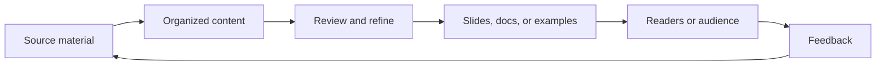

<!-- unified-readme:start -->
<div align="center">

# Presentations

**Slide decks and demo materials from conference talks and community presentations.**

Explain. Demo. Share.

[](https://github.com/JayRHa/Presentations/stargazers)
[](https://github.com/JayRHa/Presentations/network/members)
[](https://github.com/JayRHa/Presentations/issues)
[](https://github.com/JayRHa/Presentations/graphs/contributors)

<p>
  <a href="https://jannikreinhard.com/">Blog</a> ·
  <a href="https://www.linkedin.com/in/jannik-r/">LinkedIn</a> ·
  <a href="https://x.com/jannik_reinhard">X</a>
</p>

---

`Community Content` | `HTML` | `Public` | `Maintained`

</div>

## What is this?

Presentations contains learning, presentation, or documentation assets that support endpoint management and community knowledge sharing.

## Project Context

- The repository is useful when preparing demos, talks, reference material, or reusable examples.
- Content is organized so source material can be reviewed, reused, and shared consistently.
- This repository is maintained as a practical project and reference asset.

## How It Works

Source material is collected in the repository, organized into reusable sections, then rendered, presented, or referenced by readers and audiences.



## Quick Start

1. Review the project context and workflow below.
2. Clone the repository:

   ```bash
   git clone https://github.com/JayRHa/Presentations.git
   ```

3. Continue with the setup, usage, or workflow sections below.

---
<!-- unified-readme:end -->

# Presentations
